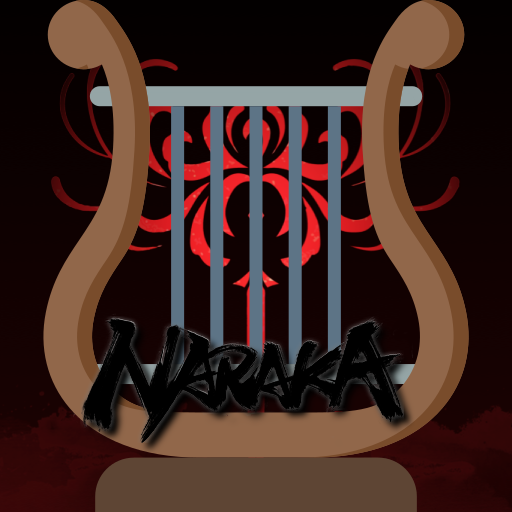

# LyreBot-Fork with Naraka Bladepoint support
NarakaMidiBot is built on the C# [DryWetMIDI midi library by melanchall](https://github.com/melanchall/drywetmidi). This library loads a MIDI file and plays it. Every note event is intercepted by LyreBot and depending on note's ID, a different combination of keys is pressed to play the sound. LyreBot (NarakaMidiBot) also allows the usage of external MIDI devices (keyboard, synthesizers, etc).
Originally, the "LyreBot" was designed for the game "Genshin Impact" to convert midi to keypresses and play the Lyre (a musical item within the game).
But the principle of operation, as well as the keys responsible for the notes are exactly the same as in naraka bladepoint.   

# ! Important notes !
I am not a programmer at all unfortunately (I have only a basic understanding of programming).
All I like is playing games and making people happy with music. For example, in Warframe - there are restrictions, only you and 3 people can hear the music, the same goes for Genshin Impact.
So, being able to play for a large number of people that are in the hub is really fascinating, so I decided to try to "modify" the code a bit so that I can use it in Naraka Bladepoint. But I have not found a ready-made solution on the Internet, so I had to make it myself and I'm posting it for public access, so that the music in the hub - never stopped. If you want to express your gratitude, the button is below.

> 💓
</b> Please support the original [@ianespana](https://github.com/ianespana) - for making original [LyreBot](https://github.com/ianespana/LyreBot) and [ShawzinBot](https://github.com/ianespana/ShawzinBot). Without it, obviously this fork wouldn't have been possible.

# Virus Scan
You can check the virus scan for the precompiled version [here](https://www.virustotal.com/gui/file/188f07521b4e82ffa1c2a9397745ca8d52486cba1220d987113980e450c269eb/detection).

# Download
You can always get the latest version of LyreBot [here](https://github.com/Kirasabi/NarakaMidiBot/releases).

# About

### What's the NarakaMidiBot?

NarakaMidiBot is a third party software which converts a MIDI input or file (.mid) to simulate a series of key presses for the instruments to play their content in Naraka Bladepoint Hub.
Any MIDI input works with this script (a MIDI keyboard, a virtual MIDI channel, etc), as well as [Standard MIDI Files (SMF)](https://www.midi.org/specifications/category/smf-specifications).   

### Is it safe?

LyreBot does not in any way interfere with gameplay, nor does it inject new code or modify existing one. It also does not tamper with memory in any way, thus is can't be catalogued as a cheat and should be safe to use. Then again, you must keep in mind **you're using this program at your own risk!**

### How does it work?

### Important things about midi

While you can load any MIDI you want into the bot, you have to keep in mind that Naraka Bladepoint has some limits. For instance, you can only play notes between C3 and B5, and you can't play any half tones in that range. Keep this in mind when trying out MIDIs.

# Getting Started
Using NarakaMidiBot is quite easy. As long as you don't separate any of it's components, it can sit anywhere in your computer. No installation is required, all you need to do is double click NarakaMidiBot.exe and you'll be good to go!

## Usage
Once the program is running you'll see the following window:

On the top left corner there's a button you can click to open and load MIDI files. Once a file is open, all you have to do is click play and tab back into game. NarakaMidiBot will not mess with your keyboard unless you're tabbed into Naraka Bladepoint!

To use an external MIDI device, all you have to do is select if from the dropdown menu and start playing. If you do not see your device, just click the reload button to the right of the dropdown.

The program defaults to playing the first MIDI track found inside the file. If you want to play a different track or tracks, all you have to do is tick your desired track(s) in the "MIDI Tracks" section. Simple.

There are 2 settings you can change at this moment:
* Transpose notes - This setting will attempt to transpose notes that are unplayable. Default on.
* Speed - This will change the MIDI playback speed. Default 1x.

